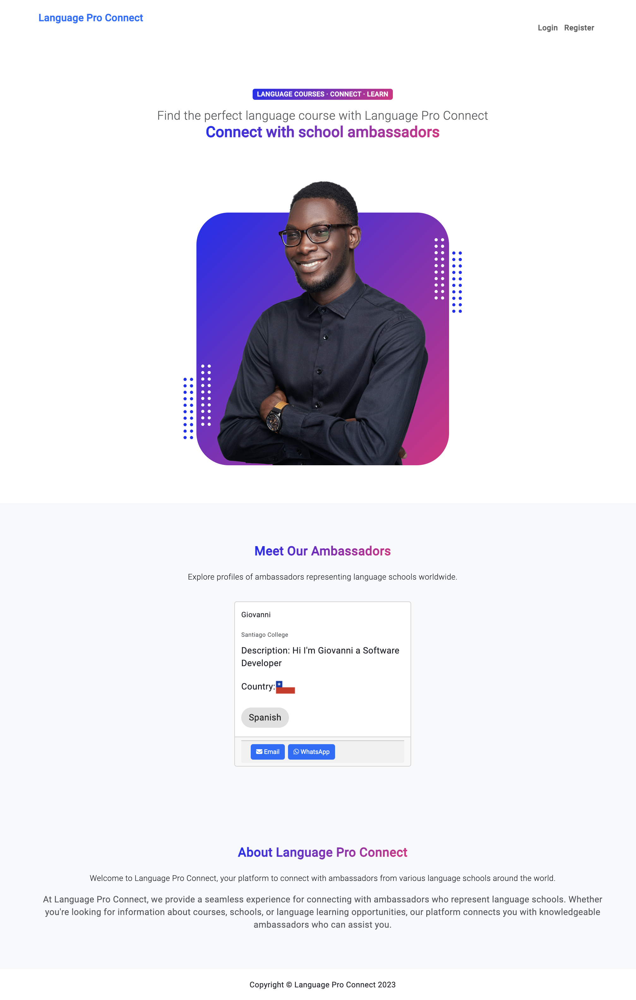

# LanguageProConnect

LanguageProConnect is a project aimed at connecting language school employers with potential employees. It consists of two main components:

## Backend - LanguageProConnect API
Repository: [LanguageProConnect API](https://github.com/Giovasdf/LanguageProConnect)

The LanguageProConnect API is developed using .NET Core and provides the backend functionality for managing language schools, employees, and other related resources.

## Frontend - LanguageProConnectFront
Repository: [LanguageProConnectFront](https://github.com/Giovasdf/LanguageProConnectFront)

LanguageProConnectFront is the frontend application developed using Angular. It offers a user-friendly interface for interacting with the LanguageProConnect system, allowing users to browse available job opportunities, submit applications, and more.

## Description
LanguageProConnect facilitates the connection between language school employers and job seekers in the language education sector. The backend API handles data management, authentication, and authorization, while the frontend application provides an intuitive interface for users to interact with the platform.

## Getting Started
To get started with LanguageProConnect, follow these steps:
1. Clone the [LanguageProConnect API](https://github.com/Giovasdf/LanguageProConnect) repository for the backend.
2. Clone the [LanguageProConnectFront](https://github.com/Giovasdf/LanguageProConnectFront) repository for the frontend.
3. Set up the backend API by following the instructions provided in its README.md.
4. Set up the frontend application by following the instructions provided in its README.md.

## Contributing
Contributions to LanguageProConnect are welcome! If you find any issues or have suggestions for improvements, please open an issue or submit a pull request in the respective repository.

## License
This project is licensed under the [Creative Commons NonCommercial License](https://creativecommons.org/licenses/by-nc/4.0/).
